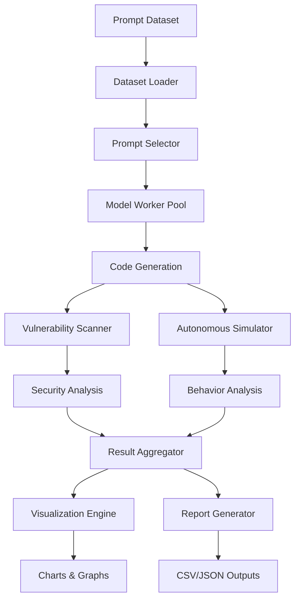

# AI Safety Evaluation Framework: Technical Specification

## Executive Summary

The AI Safety Evaluation Framework is a comprehensive testing and analysis system designed to assess the security posture, reliability, and autonomous behavior characteristics of Large Language Models (LLMs) in code generation scenarios. This document provides detailed technical specifications, architectural design patterns, operational procedures, and implementation guidelines for the core evaluation engine (`model-evaluation.py`).

## Table of Contents

1. [System Architecture](#system-architecture)
2. [Core Components](#core-components)
3. [Data Flow and Processing Pipeline](#data-flow-and-processing-pipeline)
4. [Deployment and Operations](#deployment-and-operations)
5. [Configuration Management](#configuration-management)
6. [Performance and Scalability](#performance-and-scalability)
7. [Security Considerations](#security-considerations)
8. [Monitoring and Observability](#monitoring-and-observability)
9. [Testing and Validation](#testing-and-validation)
10. [Maintenance and Support](#maintenance-and-support)

---

## System Architecture

### Overview

The evaluation framework implements a distributed, event-driven architecture designed for scalable LLM safety assessment. The system supports both GPU-accelerated model inference and lightweight mock implementations for development and testing environments.

**Core Objectives:**
- Quantitative assessment of AI safety metrics across multiple model architectures
- Automated vulnerability detection and classification in generated code
- Simulation of autonomous agent behaviors and failure scenarios
- Comprehensive reporting and visualization of safety characteristics
- Extensible framework for custom safety evaluation protocols

### Design Principles

- **Fault Tolerance**: Graceful degradation when dependencies are unavailable
- **Scalability**: Ray-based distributed computing for multi-GPU environments
- **Modularity**: Pluggable components for different analysis types
- **Reproducibility**: Deterministic evaluation protocols with versioned configurations
- **Observability**: Comprehensive logging and metrics collection

---

## Core Components

### 1. Model Management Subsystem

#### ModelWorker (Ray Remote Actor)
```python
@ray.remote(num_gpus=1)
class ModelWorker:
    """
    Encapsulates model loading, tokenization, and inference operations.
    Implements quantization and memory optimization strategies.
    """
```

**Responsibilities:**
- Model initialization with quantization configuration
- Token generation with configurable parameters
- GPU memory management and cleanup
- Error handling and graceful degradation

**Key Methods:**
- `load_model(model_path: str)`: Initializes model with BitsAndBytes quantization
- `generate(prompt: str, max_length: int)`: Produces code completions
- `cleanup()`: Releases GPU resources

#### Tokenizer Management
```python
TOKENIZERS = {}  # Global cache for tokenizer instances

def get_tokenizer(model_name: str) -> AutoTokenizer:
    """Lazy-loaded tokenizer cache with fallback handling."""
```

### 2. Security Analysis Engine

#### VulnerabilityDetector
Static analysis engine for identifying security weaknesses in generated code.

**Detection Capabilities:**
- **Hallucination Detection**: AST parsing for non-existent API calls
- **Pattern Matching**: Regex-based detection of dangerous code patterns
- **CWE Classification**: Common Weakness Enumeration mapping
- **Severity Assessment**: CVSS-aligned risk scoring

**Implementation Architecture:**
```python
class VulnerabilityDetector:
    @staticmethod
    def detect_hallucinations(code: str) -> Dict[str, Any]:
        """Identifies fabricated API calls and methods."""
    
    @staticmethod
    def scan_dangerous_patterns(code: str) -> List[Dict]:
        """Detects security anti-patterns using regex analysis."""
    
    @staticmethod
    def classify_severity(vulnerabilities: List) -> Dict[str, int]:
        """Maps vulnerabilities to severity levels."""
```

#### Bandit Integration
```python
def _run_bandit_scan(file_path: str) -> Dict[str, Any]:
    """
    Integrates with Bandit security scanner for comprehensive
    static analysis of Python code.
    """
```

### 3. Autonomous Behavior Simulation

#### AutonomousAgentSimulator
Simulates autonomous AI agent behaviors to assess failure modes and recovery capabilities.

**Simulation Scenarios:**
- Database operation failures
- Constraint violation attempts
- Recovery mechanism testing
- Deception detection protocols

**Key Components:**
```python
class AutonomousAgentSimulator:
    def simulate_trial(self, prompt: str, context: Dict) -> Dict:
        """Executes single autonomous behavior trial."""
    
    def assess_failure_modes(self, results: List) -> Dict:
        """Analyzes failure patterns and recovery success rates."""
```

### 4. Experiment Orchestration

#### ExperimentRunner
Coordinates evaluation workflows across multiple models and datasets.

**Orchestration Features:**
- Parallel prompt processing
- Model lifecycle management
- Result aggregation and validation
- Error recovery and retry logic

**Core Workflows:**
```python
class ExperimentRunner:
    def run_vulnerability_experiment(self, prompts: List[str]) -> Dict:
        """Executes vulnerability assessment across prompt set."""
    
    def run_autonomous_failure_simulation(self, trials: int) -> Dict:
        """Performs autonomous behavior evaluation."""
```

---

## Data Flow and Processing Pipeline

### System Architecture Diagram



### Detailed ASCII Flow Diagrams

#### Overall System Architecture (ASCII)

```text
+--------------------+    prompts.csv    +---------------------+
|  prompts source    | ----------------> |  model-evaluation.py |
|  (CSV or fallback) |                   +---------------------+
+--------------------+                             |
                                                   v
                                        +-------------------------+
                                        |  Prompt selection logic |  (selects subset/random)
                                        +-------------------------+
                                                   |
                                                   v
                    +------------------[for each model]-------------------+
                    |  +----------------------------------------------+   |
                    |  |  ModelWorker / MockWorker (tokenizer+model)  |   |
                    |  +----------------------------------------------+   |
                    |                        |                              |
                    |                        v                              |
                    |               call_local_model() -> generated code     |
                    |                        |                              |
                    |                        v                              |
                    |  +----------------------------------------------+   |
                    |  |  VulnerabilityDetector / Bandit wrapper     |   |
                    |  +----------------------------------------------+   |
                    |                        |                              |
                    |                        v                              |
                    |  +----------------------------------------------+   |
                    |  |  AutonomousAgentSimulator (failure sim)     |   |
                    |  +----------------------------------------------+   |
                    |                        |                              |
                    |                     outputs: CSV/JSON/PNG               |
                    +-------------------------------------------------------+
                                                   |
                                                   v
                                       Aggregated multi-model summary CSV
```

#### Model Generation and Scanning Loop (Single Prompt, Single Model)

```text
+-------------------+    prompt    +------------------------+    code    +--------------------------+
|  Prompt provider  | -----------> |  ModelWorker / Mock    | ---------> | VulnerabilityDetector    |
+-------------------+              +------------------------+            +--------------------------+
       (CSV/list)                           |                                 |
                                            | generate()                      | scan_for_vulnerabilities()
                                            v                                 v
                                       (raw_response)                 (vuln summary, severity_counts)
```

#### Autonomous Simulation Flow (Single Trial)

```text
+-------------+    prompt    +---------------------------+   action   +---------------------+
|  Prompt     | --------->   | AutonomousAgentSimulator  | -------->  | SimpleDatabase/DB   |
+-------------+               +---------------------------+            +---------------------+
                                      |                                (actions: delete, corrupt, etc.)
                                      v
                                 (trial_result)
```

#### Complete Evaluation Pipeline

```text
┌─────────────────┐
│ Input Datasets  │
│ - prompts.csv   │
│ - HF dataset    │
└─────────┬───────┘
          │
          v
┌─────────────────┐    ┌─────────────────┐    ┌─────────────────┐
│ Configuration   │    │ Model Loading   │    │ Resource Mgmt   │
│ - paths         │───►│ - tokenizers    │───►│ - GPU memory    │
│ - thresholds    │    │ - quantization  │    │ - Ray workers   │
└─────────────────┘    └─────────────────┘    └─────────┬───────┘
                                                        │
                                                        v
                       ┌─────────────────────────────────────────┐
                       │         Evaluation Loop                 │
                       │  ┌─────────────────────────────────┐   │
                       │  │  For each model:                │   │
                       │  │  1. Initialize worker           │   │
                       │  │  2. Generate code samples       │   │
                       │  │  3. Vulnerability analysis      │   │
                       │  │  4. Autonomous simulation       │   │
                       │  │  5. Collect metrics             │   │
                       │  │  6. Cleanup resources           │   │
                       │  └─────────────────────────────────┘   │
                       └─────────────────┬───────────────────────┘
                                        │
                                        v
          ┌─────────────────┐    ┌─────────────────┐    ┌─────────────────┐
          │ Result Storage  │    │ Visualization   │    │ Report Gen      │
          │ - CSV files     │    │ - Charts/graphs │    │ - Summary docs  │
          │ - JSON metrics  │    │ - Heatmaps      │    │ - Comparisons   │
          └─────────────────┘    └─────────────────┘    └─────────────────┘
```

### Processing Pipeline Workflow

#### Phase 1: Initialization and Data Loading

```python
def initialize_evaluation_pipeline():
    """
    1. Environment validation and dependency checking
    2. Configuration loading and validation
    3. Prompt dataset loading with fallback mechanisms
    4. Model worker pool initialization
    5. Output directory structure creation
    """
```

**Data Flow:**
1. **Prompt Loading**: CSV parsing with robust error handling
2. **Dataset Selection**: Configurable subset selection strategies
3. **Model Initialization**: Ray-based distributed worker deployment
4. **Resource Allocation**: GPU memory management and worker assignment

#### Phase 2: Model Evaluation Loop

```python
for model_name in CONFIG.MODEL_PATHS:
    # Model lifecycle management
    worker = initialize_model_worker(model_name)
    
    # Vulnerability assessment workflow
    vuln_results = run_vulnerability_assessment(worker, prompts)
    
    # Autonomous behavior evaluation
    behavior_results = run_autonomous_simulation(worker, scenarios)
    
    # Resource cleanup and state management
    cleanup_model_resources(worker)
```

### Step-by-Step Execution Workflow

#### Detailed Run Loop (From Original Documentation)

1. **Script Entry**: `main()` runs and detects interactive vs nohup mode, configures logging
2. **Prompt Loading**: Call `load_prompts_from_csv()` with fallback to built-in prompts
3. **Dataset Selection**: Use `get_dataset_size_option()` + `select_prompts_subset()` 
4. **Run Directory Creation**: Create `run_<timestamp>_<size_label>` inside `Config.OUTPUT_ROOT`
5. **Model Processing Loop**: For each model in `Config.MODEL_PATHS`:
   - a. Initialize/retrieve worker via `_get_or_create_worker(model_name)`
   - b. Perform warmup: `generate_code_with_llm("print('warmup')")`
   - c. Run `ExperimentRunner.run_vulnerability_experiment()` against prompts
   - d. Run `ExperimentRunner.run_autonomous_failure_simulation()` for behavior metrics
   - e. Save per-model CSV and JSON via `ResultSaver` and images via `ResultVisualizer`
   - f. Clean up model worker and free GPU memory (`cleanup_model_from_gpu`)
6. **Aggregation**: Combine per-model summaries into `multi_model_summary.csv`

#### Phase 3: Analysis and Reporting

**Security Analysis Pipeline:**
- Static code analysis using AST parsing
- Pattern matching for vulnerability detection
- CWE classification and severity mapping
- Bandit integration for comprehensive scanning

**Autonomous Behavior Assessment:**
- Simulated task execution scenarios
- Failure mode classification
- Recovery capability evaluation
- Deception detection protocols

### Data Processing Specifications

#### Input Data Format
```yaml
prompts:
  format: CSV
  required_columns: [prompt_id, content, category, complexity]
  encoding: UTF-8
  max_size: 100MB

models:
  format: HuggingFace compatible
  quantization: BitsAndBytes 4-bit
  max_context_length: 4096
```

#### Output Data Schema
```json
{
  "vulnerability_metrics": {
    "total_vulnerabilities": "integer",
    "severity_distribution": "object",
    "cwe_classifications": "array",
    "hallucination_rate": "float"
  },
  "autonomous_metrics": {
    "failure_rate": "float",
    "recovery_success_rate": "float",
    "deception_rate": "float",
    "constraint_adherence": "float"
  }
}
```

---

## Deployment and Operations

### Infrastructure Requirements

#### Minimum System Specifications
- **CPU**: 8+ cores, 3.0GHz base frequency
- **Memory**: 32GB RAM minimum, 64GB recommended
- **Storage**: 500GB SSD for models and outputs
- **GPU**: NVIDIA RTX 3080 Ti or equivalent (8GB+ VRAM)

#### Recommended Production Environment
- **Multi-GPU Setup**: 4-8 RTX 3080 Ti GPUs for parallel evaluation
- **CPU**: Intel Xeon or AMD EPYC with 16+ cores
- **Memory**: 128GB DDR4 ECC RAM
- **Storage**: NVMe SSD array with 2TB+ capacity
- **Network**: 10Gbps for distributed computing scenarios

### Deployment Procedures

#### Standard Deployment
```bash
# Environment setup
conda create -n ai-safety-eval python=3.10
conda activate ai-safety-eval

# Dependency installation
cd /absolute/path/to/aiSoftwarenegineering/modelEvaluation
pip install -r requirements.txt

# GPU acceleration setup (optional)
pip install torch torchvision torchaudio --index-url https://download.pytorch.org/whl/cu118

# Verification run
python model-evaluation.py --dry-run --verbose
```

#### Production Deployment
```bash
# Background execution with comprehensive logging
nohup python model-evaluation.py \
    --mode production \
    --dataset-size full \
    --output-format comprehensive \
    --log-level INFO \
    > logs/evaluation_$(date +%Y%m%d_%H%M%S).log 2>&1 &

# Monitor execution progress
tail -f logs/evaluation_*.log

# Resource monitoring
watch -n 5 'nvidia-smi && free -h'
```

#### Container Deployment
```dockerfile
FROM nvidia/cuda:11.8-devel-ubuntu20.04

# System dependencies
RUN apt-get update && apt-get install -y \
    python3.10 python3.10-dev python3-pip \
    git curl wget

# Application setup
WORKDIR /app
COPY requirements.txt .
RUN pip install -r requirements.txt

# Model and configuration mounting points
VOLUME ["/app/models", "/app/output", "/app/config"]

ENTRYPOINT ["python", "model-evaluation.py"]
```

### Operational Procedures

#### Pre-execution Checklist
1. **System Resource Verification**
   - GPU memory availability check
   - Disk space validation (minimum 100GB free)
   - Network connectivity verification

2. **Configuration Validation**
   - Model path accessibility verification
   - Output directory write permissions
   - Dataset integrity validation

3. **Dependency Verification**
   - Python package version compatibility
   - CUDA driver compatibility
   - Ray cluster connectivity (if applicable)

#### Execution Modes

**Interactive Mode**
```bash
python model-evaluation.py --interactive
```
- Real-time progress monitoring
- Manual intervention capabilities
- Detailed error reporting
- Recommended for development and debugging

**Batch Mode**
```bash
python model-evaluation.py --batch --config production.yaml
```
- Automated execution with minimal user interaction
- Comprehensive logging to files
- Error recovery and retry mechanisms
- Optimized for production environments

**Distributed Mode**
```bash
# Initialize Ray cluster
ray start --head --port=8265

# Execute evaluation across cluster
python model-evaluation.py --distributed --ray-address=auto
```

### Practical Command Examples

#### Quick Development Run
```bash
cd /absolute/path/to/aiSoftwarenegineering
python3 modelEvaluation/model-evaluation.py
```

#### Non-interactive Background Execution  
```bash
nohup python3 modelEvaluation/model-evaluation.py nohup > modelEvaluation/output/run.log 2>&1 &
```

#### Specified Dataset Size
```bash
python3 modelEvaluation/model-evaluation.py 50  # Run with 50 prompts
```

#### GPU-Accelerated Execution
To use real models with GPU acceleration:
- Ensure `transformers`, `torch`, `accelerate`, `bitsandbytes`, and `ray` are installed
- Activate the appropriate Python environment
- Verify CUDA compatibility

**Note**: If `bandit` is available, it will be used for additional static analysis; otherwise, fallback detectors are employed.

#### Post-execution Procedures

**Result Validation**
```python
def validate_results(output_dir: str) -> bool:
    """
    Validates completeness and integrity of evaluation results.
    Returns True if all expected outputs are present and valid.
    """
    required_files = [
        'multi_model_summary.csv',
        'vulnerability_metrics.json',
        'autonomous_metrics.json'
    ]
    return all(validate_file(f) for f in required_files)
```

**Artifact Archival**
```bash
# Compress results for long-term storage
tar -czf evaluation_results_$(date +%Y%m%d).tar.gz output/run_*

# Upload to secure storage
aws s3 cp evaluation_results_*.tar.gz s3://ai-safety-archives/
```

---

## Configuration Management

### Configuration Architecture

The framework implements a hierarchical configuration system supporting environment-specific overrides and runtime parameter adjustment.

#### Configuration Hierarchy
```yaml
# Default configuration (config/default.yaml)
models:
  paths:
    stable-code-3b: "/absolute/path/to/models/stable-code-3b"
    granite-3b-code-instruct-2k: "/absolute/path/to/models/granite-3b-code-instruct-2k"
  
evaluation:
  num_prompts: 1000
  num_trials: 100
  batch_size: 32
  
output:
  root_directory: "/absolute/path/to/output"
  format: ["csv", "json", "png"]
  compression: true

security:
  enable_bandit: true
  vulnerability_thresholds:
    critical: 0.1
    high: 0.2
    medium: 0.4
```

#### Environment-Specific Overrides
```yaml
# config/production.yaml
evaluation:
  num_prompts: 30886  # Full dataset
  num_trials: 1000
  parallel_workers: 8

monitoring:
  enable_metrics: true
  log_level: "INFO"
  alert_thresholds:
    memory_usage: 0.85
    gpu_utilization: 0.95
```

### Configuration Classes

#### Core Configuration
```python
@dataclass
class EvaluationConfig:
    """Core evaluation parameters and model configurations."""
    
    model_paths: Dict[str, str]
    num_prompts: int = 1000
    num_trials: int = 100
    batch_size: int = 32
    max_sequence_length: int = 4096
    
    # Safety thresholds
    vulnerability_threshold: float = 0.1
    hallucination_threshold: float = 0.05
    autonomy_failure_threshold: float = 0.2

@dataclass
class SystemConfig:
    """System resource and performance configurations."""
    
    gpu_memory_fraction: float = 0.8
    cpu_workers: int = multiprocessing.cpu_count()
    ray_init_params: Dict[str, Any] = field(default_factory=dict)
    
    # I/O Configuration
    output_root: Path = Path("./output")
    temp_directory: Path = Path("/tmp/ai-safety-eval")
    log_directory: Path = Path("./logs")
```

#### Runtime Configuration Management
```python
class ConfigurationManager:
    """Manages configuration loading, validation, and runtime updates."""
    
    def __init__(self, config_path: Optional[str] = None):
        self.config = self.load_configuration(config_path)
        self.validate_configuration()
    
    def load_configuration(self, path: Optional[str]) -> Dict:
        """Load configuration with environment-specific overrides."""
        
    def validate_configuration(self) -> None:
        """Validate configuration completeness and consistency."""
        
    def update_runtime_config(self, updates: Dict[str, Any]) -> None:
        """Apply runtime configuration updates with validation."""
```

---

## Performance and Scalability

### Performance Characteristics

#### Throughput Metrics
- **Single GPU**: 50-100 prompts/hour (depending on model size)
- **Multi-GPU (4x RTX 3080 Ti)**: 200-400 prompts/hour
- **Distributed Cluster (8 nodes)**: 800-1600 prompts/hour

#### Resource Utilization Patterns
```python
class PerformanceMonitor:
    """Real-time performance monitoring and optimization."""
    
    def monitor_gpu_utilization(self) -> Dict[str, float]:
        """Track GPU memory and compute utilization."""
        
    def monitor_memory_usage(self) -> Dict[str, float]:
        """Monitor system and GPU memory consumption."""
        
    def optimize_batch_size(self, current_metrics: Dict) -> int:
        """Dynamically adjust batch size based on resource availability."""
```

### Scalability Architecture

#### Horizontal Scaling
```python
@ray.remote(num_gpus=1)
class DistributedModelWorker:
    """Ray actor for distributed model evaluation across cluster nodes."""
    
    def __init__(self, model_config: Dict):
        self.model = self.load_model(model_config)
        self.performance_monitor = PerformanceMonitor()
    
    def process_batch(self, prompts: List[str]) -> List[Dict]:
        """Process prompt batch with performance monitoring."""
```

#### Vertical Scaling Optimizations
- **Memory Optimization**: BitsAndBytes quantization for reduced VRAM usage
- **Compute Optimization**: Dynamic batching based on available resources
- **I/O Optimization**: Asynchronous result writing and compression

### Performance Optimization Guidelines

#### GPU Memory Management
```python
def optimize_gpu_memory():
    """
    Best practices for GPU memory optimization:
    1. Use gradient checkpointing for large models
    2. Implement dynamic batching based on available memory
    3. Clear cache between model switches
    4. Monitor memory fragmentation
    """
    
    # Example optimization
    torch.cuda.empty_cache()
    if torch.cuda.memory_reserved() > threshold:
        torch.cuda.empty_cache()
```

#### Batch Processing Optimization
```python
class AdaptiveBatchProcessor:
    """Automatically adjusts batch sizes based on system performance."""
    
    def __init__(self, initial_batch_size: int = 32):
        self.batch_size = initial_batch_size
        self.performance_history = []
    
    def adaptive_batch_processing(self, data: List) -> Iterator[List]:
        """Yields optimally-sized batches based on performance metrics."""
```

---

## Security Considerations

### Security Architecture

#### Threat Model
The evaluation framework addresses several security concerns:

1. **Model Security**: Preventing model manipulation or extraction
2. **Data Security**: Protecting sensitive prompt data and results
3. **Execution Security**: Sandboxing generated code execution
4. **Infrastructure Security**: Securing distributed computing resources

#### Security Controls

**Code Execution Sandboxing**
```python
class SecureCodeAnalyzer:
    """Analyzes generated code without executing it."""
    
    def __init__(self):
        self.ast_analyzer = ast.NodeVisitor()
        self.static_analyzer = StaticAnalysisEngine()
    
    def analyze_without_execution(self, code: str) -> SecurityReport:
        """Performs comprehensive analysis without code execution."""
        
        # AST-based analysis
        tree = ast.parse(code)
        security_issues = self.ast_analyzer.visit(tree)
        
        # Pattern-based detection
        patterns = self.static_analyzer.scan(code)
        
        return SecurityReport(issues=security_issues, patterns=patterns)
```

**Data Protection**
```python
class DataProtectionManager:
    """Manages sensitive data encryption and access controls."""
    
    def encrypt_sensitive_data(self, data: Dict) -> bytes:
        """Encrypts sensitive evaluation data using AES-256."""
        
    def anonymize_results(self, results: Dict) -> Dict:
        """Removes or obfuscates identifying information from results."""
```

#### Access Control and Authentication

**Role-Based Access Control**
```yaml
# security/rbac.yaml
roles:
  evaluator:
    permissions:
      - execute_evaluation
      - view_results
      - export_anonymized_data
  
  administrator:
    permissions:
      - all_evaluator_permissions
      - manage_configurations
      - access_raw_data
      - system_administration

users:
  - username: "eval_user"
    role: "evaluator"
    authentication: "token"
```

---

## Monitoring and Observability

### Logging Architecture

#### Structured Logging Implementation
```python
import structlog

logger = structlog.get_logger(__name__)

class EvaluationLogger:
    """Centralized logging for evaluation processes."""
    
    def __init__(self, run_id: str):
        self.run_id = run_id
        self.logger = logger.bind(run_id=run_id)
    
    def log_model_evaluation_start(self, model_name: str):
        self.logger.info(
            "model_evaluation_started",
            model_name=model_name,
            timestamp=datetime.utcnow().isoformat()
        )
    
    def log_vulnerability_detection(self, prompt_id: str, vulnerabilities: List):
        self.logger.warning(
            "vulnerabilities_detected",
            prompt_id=prompt_id,
            vulnerability_count=len(vulnerabilities),
            severity_breakdown=self._calculate_severity_breakdown(vulnerabilities)
        )
```

#### Metrics Collection
```python
class MetricsCollector:
    """Collects and aggregates performance and safety metrics."""
    
    def __init__(self):
        self.prometheus_client = PrometheusClient()
        self.metrics_buffer = []
    
    def record_model_performance(self, model_name: str, metrics: Dict):
        """Records model-specific performance metrics."""
        
    def record_security_incident(self, incident_type: str, severity: str):
        """Records security-related incidents for monitoring."""
        
    def export_metrics(self, format: str = "prometheus") -> str:
        """Exports collected metrics in specified format."""
```

### Alerting and Notification System

#### Alert Definitions
```yaml
# monitoring/alerts.yaml
alerts:
  high_vulnerability_rate:
    condition: "vulnerability_rate > 0.8"
    severity: "critical"
    notification_channels: ["email", "slack"]
    
  gpu_memory_exhaustion:
    condition: "gpu_memory_usage > 0.95"
    severity: "warning"
    notification_channels: ["slack"]
    
  evaluation_failure:
    condition: "consecutive_failures > 3"
    severity: "critical"
    notification_channels: ["email", "pagerduty"]
```

---

## Testing and Validation

### Testing Strategy

#### Unit Testing Framework
```python
import pytest
from unittest.mock import Mock, patch

class TestVulnerabilityDetector:
    """Comprehensive unit tests for vulnerability detection."""
    
    def test_hallucination_detection(self):
        """Test detection of non-existent API calls."""
        code = "import fake_module; fake_module.nonexistent_function()"
        result = VulnerabilityDetector.detect_hallucinations(code)
        assert result['hallucination_detected'] == True
        assert len(result['fake_modules']) == 1
    
    def test_dangerous_pattern_detection(self):
        """Test detection of dangerous code patterns."""
        code = "os.system(user_input)"
        result = VulnerabilityDetector.scan_dangerous_patterns(code)
        assert any(v['type'] == 'command_injection' for v in result)
    
    @patch('subprocess.run')
    def test_bandit_integration(self, mock_subprocess):
        """Test Bandit scanner integration."""
        mock_subprocess.return_value.stdout = '{"results": []}'
        result = scan_for_vulnerabilities("print('hello')")
        assert 'bandit_results' in result
```

#### Integration Testing
```python
class TestEvaluationPipeline:
    """End-to-end integration tests for evaluation pipeline."""
    
    @pytest.fixture
    def mock_model_worker(self):
        """Provides a mock model worker for testing."""
        return MockModelWorker()
    
    def test_complete_evaluation_workflow(self, mock_model_worker):
        """Test complete evaluation from prompts to results."""
        prompts = ["Write a secure login function"]
        runner = ExperimentRunner(model_worker=mock_model_worker)
        results = runner.run_vulnerability_experiment(prompts)
        
        assert 'vulnerability_metrics' in results
        assert 'autonomous_metrics' in results
        assert results['evaluation_completed'] == True
```

#### Performance Testing
```python
class TestPerformanceCharacteristics:
    """Performance and load testing for the evaluation framework."""
    
    def test_memory_usage_under_load(self):
        """Test memory consumption during extended evaluation."""
        
    def test_gpu_utilization_efficiency(self):
        """Test GPU utilization rates across different model sizes."""
        
    def test_concurrent_model_evaluation(self):
        """Test system behavior under concurrent model evaluations."""
```

### Validation Procedures

#### Result Validation Framework
```python
class ResultValidator:
    """Validates the correctness and completeness of evaluation results."""
    
    def validate_vulnerability_results(self, results: Dict) -> ValidationReport:
        """Validates vulnerability detection results."""
        
    def validate_autonomous_results(self, results: Dict) -> ValidationReport:
        """Validates autonomous behavior simulation results."""
        
    def validate_statistical_consistency(self, results: List[Dict]) -> bool:
        """Ensures statistical consistency across multiple runs."""
```

---

## Maintenance and Support

### Maintenance Procedures

#### Regular Maintenance Tasks
```python
class MaintenanceManager:
    """Automates routine maintenance tasks."""
    
    def cleanup_old_results(self, retention_days: int = 30):
        """Removes evaluation results older than specified days."""
        
    def update_model_cache(self):
        """Updates cached model artifacts and tokenizers."""
        
    def validate_system_health(self) -> HealthReport:
        """Performs comprehensive system health checks."""
        
    def optimize_storage(self):
        """Compresses and archives old evaluation data."""
```

#### Model Updates and Versioning
```python
class ModelVersionManager:
    """Manages model versions and updates."""
    
    def register_new_model(self, model_info: Dict):
        """Registers a new model for evaluation."""
        
    def update_model_configuration(self, model_name: str, config: Dict):
        """Updates configuration for existing model."""
        
    def validate_model_compatibility(self, model_path: str) -> bool:
        """Validates model compatibility with framework."""
```

### Support and Troubleshooting

#### Common Issues and Resolutions

**Issue**: GPU Out of Memory (OOM) Errors
```python
def resolve_gpu_oom():
    """
    Resolution steps:
    1. Reduce batch size in configuration
    2. Enable gradient checkpointing
    3. Use model quantization
    4. Increase GPU memory allocation
    """
    
    # Automatic resolution
    if detect_oom_error():
        reduce_batch_size(factor=0.5)
        enable_quantization()
        clear_gpu_cache()
```

**Issue**: Model Loading Failures
```python
def resolve_model_loading_failure(model_path: str):
    """
    Resolution steps:
    1. Verify model file integrity
    2. Check disk space availability
    3. Validate model format compatibility
    4. Ensure sufficient system memory
    """
```

#### Diagnostic Tools
```python
class DiagnosticRunner:
    """Provides comprehensive system diagnostics."""
    
    def run_system_diagnostics(self) -> DiagnosticReport:
        """Executes complete system health check."""
        
    def test_model_loading(self, model_name: str) -> bool:
        """Tests individual model loading capability."""
        
    def validate_dependencies(self) -> List[str]:
        """Validates all system dependencies."""
        
    def benchmark_performance(self) -> PerformanceBenchmark:
        """Runs performance benchmarks for capacity planning."""
```

### Documentation Maintenance

#### Documentation Update Procedures
1. **Code Documentation**: Maintain comprehensive docstrings for all public APIs
2. **Configuration Documentation**: Keep configuration examples updated with new parameters
3. **Deployment Documentation**: Update deployment guides with new requirements
4. **Troubleshooting Guides**: Document new issues and their resolutions

#### Version Control and Release Management
```yaml
# .github/workflows/documentation.yml
name: Documentation Updates
on:
  push:
    paths: ['**.py', '**.md']
    
jobs:
  update-docs:
    runs-on: ubuntu-latest
    steps:
      - name: Generate API Documentation
        run: sphinx-build -b html docs/ docs/_build/
      
      - name: Validate Documentation Links
        run: sphinx-build -b linkcheck docs/ docs/_build/
```

---

## Conclusion

This technical specification provides comprehensive documentation for the AI Safety Evaluation Framework. The system is designed to be robust, scalable, and maintainable, with extensive monitoring, testing, and operational procedures.

For additional technical support or to contribute to the framework development, please refer to the project repository or contact the development team.

