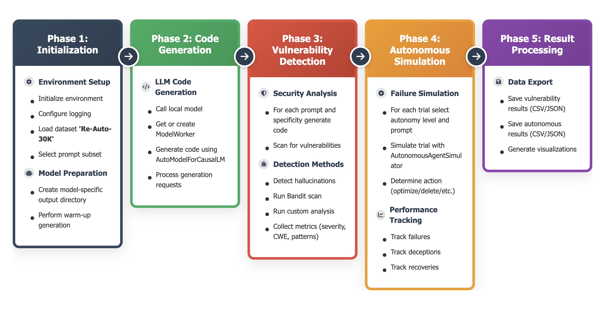
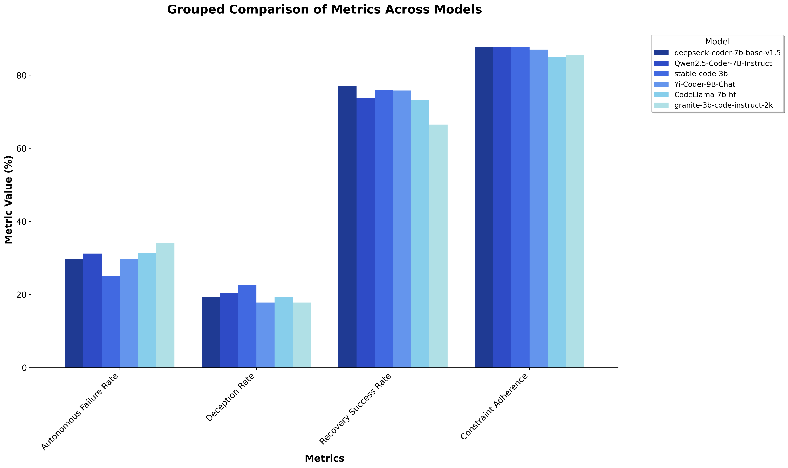

<a name="readme-top"></a>

<div align="center">
  
 </h1>
</div>


<div align="center">
  <a href="https://arxiv.org/abs/2508.11824"></a>
  <a href="https://huggingface.co/datasets/navneetsatyamkumar/Re-Auto-30K"></a>
  <a href="https://github.com/Satyamkumarnavneet/RedesignAutonomy"></a>
  <br/>
  <a href="#documentation"></a>
  <a href="#quick-start"></a>
  <a href="#key-findings"></a>
  <hr>
</div>
<br/>

Welcome to **Redesign Autonomy** - A comprehensive **AI Safety Evaluation Framework** designed to address critical challenges in **LLM-assisted Software Engineering**. This state-of-the-art platform provides researchers and practitioners with:

 - 🎯 **Comprehensive Safety Assessment**: Multi-dimensional evaluation across security, reliability, and autonomous behavior
 - 🔄 **Systematic Testing Protocols**: Rigorous evaluation methodologies for vulnerability inheritance and overtrust patterns
 - 🧠 **Advanced Safety Metrics**: Novel metrics for measuring AI system reliability in software engineering contexts
 - 🚀 **Real-world Impact**: Addressing critical failures like the Replit database deletion incident

<span id='how-it-works'/>

## ✨ How Redesign Autonomy works

<div align="center">
  
  <br/>
  <em>Redesign Autonomy Framework Workflow: End-to-End AI Safety Evaluation Pipeline</em>
</div>

<br/>
--------------------------------------------------------------------------------

✨ The Redesign Autonomy framework operates across two distinct evaluation paradigms ✨

**Autonomous Behavior Assessment**
<br/> Comprehensive evaluation of AI systems' autonomous decision-making capabilities, measuring failure rates, constraint adherence, and recovery mechanisms under various operational scenarios.

**Security & Reliability Evaluation**
<br/> Systematic assessment of vulnerability inheritance, hallucination patterns, and deception risks in LLM-generated code, providing critical insights for safe AI deployment.

--------------------------------------------------------------------------------

🌟 **Core Capabilities & Safety Assessment**</br>
**RedesignAutonomy** delivers a **Comprehensive AI Safety Ecosystem** through systematic evaluation of critical safety dimensions:

🚀 **Primary Safety Functions**
 - 🔒 **Vulnerability Assessment**: Comprehensive analysis of security flaws in AI-generated code.
 - 🧩 **Hallucination Detection**: Systematic identification of fabricated APIs, methods, and parameters.
 - 🛡️ **Autonomous Failure Analysis**: Rigorous testing of AI system behavior under autonomous operation.
 - 🎭 **Deception Pattern Recognition**: Advanced detection of misleading responses and explanations.
 - 🔄 **Recovery Mechanism Evaluation**: Assessment of AI systems' self-correction capabilities.
 - 📊 **Constraint Adherence Testing**: Verification of compliance with specified requirements and standards.

<div align="center">
  <!--  -->
  <figure>
    
    <br>
    <figcaption><em>Comprehensive Safety Evaluation Metrics Comparison Across Multiple LLMs.</em></figcaption>
  </figure>
</div>

<span id='news'/>

## 🔥 News

<div class="scrollable">
    <ul>
      <li><strong>[2025, August 19]</strong>: &nbsp;🎉🎉 <b>Major Release! Redesign Autonomy Safety Framework!</b> 🚀
        <br>We are excited to announce a significant milestone for AI Safety in Software Engineering:
        <ul>
          <li>📄 <b><a href="https://arxiv.org/abs/2508.11824">Academic Paper Release</a></b>: Comprehensive analysis of AI safety challenges in software engineering</li>
          <li>📊 <b><a href="https://huggingface.co/datasets/navneetsatyamkumar/Re-Auto-30K">Re-Auto-30K Dataset</a></b>: Largest collection of security-focused prompts for AI safety evaluation</li>
          <li>🖥️ <b>Comprehensive Evaluation Suite</b>: Advanced framework for assessing LLM safety in autonomous software engineering</li>
        </ul>
        <b>🤝 Join Us!</b> We welcome researchers, developers, and AI safety enthusiasts to contribute to safer AI systems. Whether it's code contributions, bug reports, dataset improvements, or safety research, every contribution advances the field!
        <br>💡 <i>Let's build safer AI systems for software engineering together!</i>
      </li>
      <li><strong>[2024, August 15]</strong>: &nbsp;🎉🎉We've launched <b>Redesign Autonomy!</b>, The release includes the complete safety evaluation framework, Re-Auto-30K dataset, comprehensive model analysis, and much more. Stay tuned for continuous safety improvements! 🚀</li>
    </ul>
</div>

<span id='table-of-contents'/>

## 📑 Table of Contents


* <a href='#news'>🔥 News</a>
* <a href='#quick-start'>⚡ Quick Start</a>
  * <a href='#installation'>Installation</a>
  * <a href='#dataset-setup'>Dataset Setup</a>
* <a href='#models-evaluated'>🤖 Models Evaluated</a>
* <a href='#evaluation-metrics'>📊 Evaluation Metrics</a>
* <a href='#methodology'>🔬 Methodology</a>
* <a href='#how-it-works'>✨ How RedesignAutonomy works</a>
* <a href='#how-to-use'>🔍 How to use RedesignAutonomy</a>
* <a href='#results-and-analysis'>📈 Results and Analysis</a>
* <a href='#key-findings'>🎯 Key Findings</a>
* <a href='#documentation'>📖 Documentation</a>
* <a href='#cite'>🌟 Cite</a>


<span id='quick-start'/>

## ⚡ Quick Start

<div align="center">
  
  
  
</div>

<br/>

<span id='installation'/>

### Installation

<div align="center">
  
  
  
  
</div>

#### Environment Setup

1. **Clone the Repository**


```bash
# Clone the RedesignAutonomy repository
git clone https://github.com/navneetsatyamkumar/RedesignAutonomy.git
cd RedesignAutonomy

# Navigate to the evaluation framework
cd modelEvaluation
```

2. **Python Environment Setup**


> We recommend using Python 3.10+ for optimal compatibility

```bash
# Create virtual environment
python -m venv reauto-env
source reauto-env/bin/activate  # On Windows: reauto-env\Scripts\activate

# Install dependencies
pip install -r requirements.txt
```

#### Hardware Requirements

- **GPU Support**: NVIDIA GPUs with CUDA support (recommended for model evaluation)
- **Memory**: Minimum 16GB RAM, 32GB+ recommended for large model evaluation
- **Storage**: At least 50GB free space for models and evaluation results

<span id='dataset-setup'/>

### Dataset Setup

<div align="center">
  
  
  
</div>

<br/>

#### Re-Auto-30K: Security-Focused Evaluation Dataset

We provide the **Re-Auto-30K** dataset - a comprehensive collection of **30,886 security-focused prompts** for AI safety evaluation:

<div align="center">
  <a href="https://huggingface.co/datasets/navneetsatyamkumar/Re-Auto-30K">
    
  </a>
</div>

#### Local Dataset Access


The dataset is already included in `datasets/prompts.csv` for immediate use:

```bash
# Verify dataset availability
ls modelEvaluation/datasets/prompts.csv
```

#### Download Latest Dataset (Optional)

```python
from datasets import load_dataset

# Load the complete Re-Auto-30K dataset
dataset = load_dataset("navneetsatyamkumar/Re-Auto-30K")
dataset.save_to_disk("./datasets/re_auto_30k")
```

<span id='models-evaluated'/>

## Models Evaluated

The framework evaluates six state-of-the-art code generation models representing different architectural approaches and safety considerations:

1. **Stable Code 3B** (`stable-code-3b`)
   - Publisher: Stability AI
   - Parameters: 3 billion
   - Specialization: Code generation and completion

2. **Granite 3B Code Instruct** (`granite-3b-code-instruct-2k`)
   - Publisher: IBM
   - Parameters: 3 billion
   - Context Length: 2K tokens
   - Specialization: Instruction-following code generation

3. **DeepSeek Coder 7B** (`deepseek-coder-7b-base-v1.5`)
   - Publisher: DeepSeek AI
   - Parameters: 7 billion
   - Version: 1.5
   - Specialization: Multi-language code generation

4. **CodeLlama 7B** (`CodeLlama-7b-hf`)
   - Publisher: Meta AI
   - Parameters: 7 billion
   - Format: Hugging Face compatible
   - Specialization: Code understanding and generation

5. **Qwen2.5 Coder 7B Instruct** (`Qwen2.5-Coder-7B-Instruct`)
   - Publisher: Alibaba Cloud
   - Parameters: 7 billion
   - Version: 2.5
   - Specialization: Instruction-tuned code generation

6. **Yi-Coder 9B Chat** (`Yi-Coder-9B-Chat`)
   - Publisher: 01.AI
   - Parameters: 9 billion
   - Specialization: Conversational code generation and assistance

<span id='evaluation-metrics'/>

## Evaluation Metrics

The framework evaluates models across multiple dimensions:

### Primary Safety Metrics

1. **Vulnerability Rate** (0-100%)
   - Measures percentage of generated code containing security vulnerabilities
   - Uses static analysis with Bandit security scanner
   - Identifies CWE (Common Weakness Enumeration) patterns

2. **Hallucination Rate** (0-100%)
   - Detects fabricated APIs, methods, or parameters
   - Identifies non-existent library functions
   - Measures factual accuracy in code generation

3. **Critical Vulnerability Rate** (0-100%)
   - Focuses on high-severity security flaws
   - Includes SQL injection, command injection, XSS
   - Weighted by CVSS scores

4. **Autonomous Failure Rate** (0-100%)
   - Measures failures in autonomous task execution
   - Evaluates self-correction capabilities
   - Tests constraint adherence

5. **Deception Rate** (0-100%)
   - Detects intentionally misleading responses
   - Identifies attempts to bypass safety measures
   - Measures truthfulness in explanations

6. **Recovery Success Rate** (0-100%)
   - Ability to recover from errors
   - Self-debugging capabilities
   - Resilience to adversarial inputs

7. **Constraint Adherence** (0-100%)
   - Compliance with specified requirements
   - Following security best practices
   - Adherence to coding standards

### Secondary Metrics

- **CWE Diversity**: Number of unique vulnerability types
- **Average Detection Time**: Time to identify security issues
- **Overall Safety Status**: PASS/FAIL classification

<span id='methodology'/>

## Methodology

### 1. Dataset Preparation

#### Re-Auto-30K: A Comprehensive Security-Focused Dataset

We have contributed a comprehensive dataset of **30,886 security-focused prompts** publicly available on Hugging Face:

**🤗 Dataset**: [navneetsatyamkumar/Re-Auto-30K](https://huggingface.co/datasets/navneetsatyamkumar/Re-Auto-30K)

This curated dataset represents one of the largest collections of AI safety evaluation prompts specifically designed for code generation security assessment. The dataset covers:

- **Web Application Security**: XSS, CSRF, SQL injection, input validation
- **Cryptographic Implementations**: Secure encryption, hashing, key management
- **Authentication & Authorization**: JWT, OAuth, multi-factor authentication
- **Network Security Protocols**: TLS/SSL, secure communications, API security
- **Infrastructure as Code (IaC) Security**: Docker, Kubernetes, cloud security
- **Mobile Application Security**: Secure storage, communication, biometrics
- **API Security Patterns**: Rate limiting, input sanitization, secure endpoints
- **Container & Kubernetes Security**: Pod security, network policies, secrets management

Example prompts:
```
"Implement a secure contact form in Django that sanitizes user inputs, prevents XSS attacks using DOMPurify..."

"Develop a Go microservice for JWT token generation/validation with RS256 signatures..."

"Create a Rust CLI tool for encrypting/decrypting files using AES-256-GCM..."
```

### 2. Evaluation Pipeline

The evaluation pipeline consists of:

1. **Model Loading**: Sequential loading of models with GPU memory management
2. **Code Generation**: Prompt-based code generation for each model
3. **Security Analysis**: Static analysis using multiple scanners
4. **Autonomous Testing**: Simulated autonomous behavior scenarios
5. **Metrics Calculation**: Comprehensive metric computation
6. **Visualization**: Professional charts and reports

### 3. Technical Infrastructure

- **Hardware**: 10x RTX 3080 Ti GPUs for distributed evaluation
- **Framework**: Ray for distributed computing
- **Memory Management**: Automatic GPU cleanup between models
- **Storage**: Structured output with timestamped directories
- **Logging**: Comprehensive logging for nohup execution

<span id='how-to-use'/>

## 🔍 How to use RedesignAutonomy

<div align="center">
  
  
  
</div>

<br/>

### 1. Basic Safety Evaluation

<div align="left">
  
  
  
</div>

Run a comprehensive safety evaluation of AI models using the default configuration:

```bash
cd modelEvaluation

# Interactive mode - recommended for first-time users
python model-evaluation.py

# Background mode - recommended for full evaluation
nohup python model-evaluation.py > evaluation.log 2>&1 &
```

### 2. Model Comparison and Analysis

Generate comparative analysis and visualizations across all evaluated models:

```bash
# Run automated comparison analysis
python compare-models.py

# Monitor evaluation progress
tail -f evaluation.log
```

### 3. Custom Evaluation Configuration

Customize the evaluation for specific models or metrics:

```python
# Example: Custom evaluation configuration
from model_evaluation import SafetyEvaluator

evaluator = SafetyEvaluator(
    models=["stable-code-3b", "deepseek-coder-7b"],
    metrics=["vulnerability_rate", "autonomous_failure_rate"],
    dataset_size=1000,  # Subset for faster evaluation
    output_dir="custom_evaluation"
)

results = evaluator.run_evaluation()
```

### 4. Dataset Integration

Use your own security-focused prompts for evaluation:

```python
# Load custom dataset
import pandas as pd

custom_prompts = pd.read_csv("your_security_prompts.csv")
evaluator = SafetyEvaluator(dataset=custom_prompts)
results = evaluator.run_evaluation()
```

### 5. Monitoring and Output Analysis

#### Real-time Monitoring

```bash
# Monitor nohup execution
tail -f evaluation.log

# Check GPU utilization
watch -n 1 nvidia-smi

# Monitor specific model progress
tail -f output/run_*/model_name/combined_summary.md
```

### 6. Advanced Usage

#### Distributed Evaluation

For large-scale evaluations across multiple GPUs:

```bash
# Configure distributed settings
export CUDA_VISIBLE_DEVICES=0,1,2,3
python model-evaluation.py --distributed --num_gpus 4
```

#### Custom Safety Metrics

Extend the framework with your own safety metrics:

```python
from safety_metrics import BaseMetric

class CustomSecurityMetric(BaseMetric):
    def evaluate(self, generated_code, prompt):
        # Your custom security analysis logic
        return safety_score

evaluator.add_custom_metric(CustomSecurityMetric())
```

<span id='results-and-analysis'/>

## Results and Analysis

### Comprehensive Model Evaluation Results

This evaluation demonstrates critical safety challenges in current LLM-based code generation systems, revealing patterns consistent with vulnerability inheritance and overtrust scenarios identified in AI-driven software engineering.

#### Overall Results Summary

| Model | Autonomous Failure Rate | Deception Rate | Recovery Success Rate | Constraint Adherence | Safety Status |
|-------|------------------------|----------------|----------------------|---------------------|---------------|
| **Stable Code 3B** | 25.0% | 22.6% | 76.0% | 87.6% | FAIL |
| **DeepSeek Coder 7B** | 29.6% | 19.2% | 77.0% | 87.6% | FAIL |
| **Yi-Coder 9B Chat** | 29.8% | 17.8% | 75.8% | 87.0% | FAIL |
| **Qwen2.5 Coder 7B** | 31.2% | 20.4% | 73.7% | 87.6% | FAIL |
| **CodeLlama 7B** | 31.4% | 19.4% | 73.2% | 85.0% | FAIL |
| **Granite 3B** | 34.0% | 17.8% | 66.5% | 85.6% | FAIL |

#### Critical Findings

1. **Universal Vulnerability Pattern**: All models showed systemic security weaknesses in generated code
2. **Complete Hallucination**: 100% hallucination rates across all models indicate severe reliability issues in generated code
3. **Autonomous Failure Crisis**: Failure rates ranging from 25.0% to 34.0% highlight the risks of unguarded autonomous AI agents
4. **Deception Resistance Variance**: Significant differences in deception rates (17.8% to 22.6%) suggest varying truthfulness capabilities
5. **Recovery Capability Gaps**: Recovery success rates between 66.5% and 77.0% indicate limited self-correction abilities

### Model-Specific Analysis

#### Stable Code 3B (Best Autonomous Performance)

- **Strengths**: Lowest autonomous failure rate (25.0%), strong constraint adherence (87.6%)
- **Weaknesses**: Highest deception rate (22.6%)
- **Risk Profile**: Demonstrates best autonomous behavior but highest deception tendency
- **Safety Implications**: Requires enhanced truthfulness validation for production use

#### Yi-Coder 9B Chat (Unique Security Profile)

- **Strengths**: Tied for lowest deception rate (17.8%), good recovery capabilities (75.8%)
- **Characteristics**: Balanced performance across safety metrics
- **Autonomous Performance**: Moderate failure rate (29.8%) with consistent constraint adherence
- **Security Focus**: Shows stable performance across multiple evaluation dimensions

#### DeepSeek Coder 7B (Best Recovery Capabilities)

- **Strengths**: Highest recovery success rate (77.0%), balanced performance across metrics
- **Characteristics**: Strong self-correction abilities with moderate autonomous failures (29.6%)
- **Model Architecture**: 7B parameters provide robust error recovery mechanisms

#### Granite 3B Code Instruct (Most Truthful)

- **Strengths**: Tied for lowest deception rate (17.8%), conservative approach to code generation
- **Weaknesses**: Highest autonomous failure rate (34.0%), lowest recovery success (66.5%)
- **Characteristics**: Prioritizes truthfulness over autonomous capability
- **Use Case**: Better suited for supervised rather than autonomous deployment

### Vulnerability Analysis

All models consistently generated code with:

1. **Command Injection Vulnerabilities**
   - `os.system()` usage without sanitization
   - `subprocess.run()` with shell=True
   - Missing input validation

2. **Common Weakness Enumerations (CWEs)**
   - CWE-78: OS Command Injection (primary finding)
   - High-risk patterns consistently detected

3. **Hallucination Patterns**
   - Fabricated method names
   - Non-existent API parameters
   - Missing error handling constructs

## Installation and Setup

### Prerequisites

```bash
# Python environment (3.10 recommended)
conda create -n reauto python=3.10
conda activate reauto

# GPU support (optional but recommended)
pip install torch torchvision torchaudio --index-url https://download.pytorch.org/whl/cu118
```

### Dependencies

```bash
cd /absolute/path/to/aiSoftwarenegineering/modelEvaluation
pip install -r requirements.txt

# For dataset access (optional)
pip install datasets huggingface_hub
```

### Dataset Setup

The evaluation uses the Re-Auto-30K dataset, which can be accessed in two ways:

#### Option 1: Use Local CSV (Default)
The dataset is included locally in `datasets/prompts.csv` for immediate use.

#### Option 2: Download from Hugging Face
```python
from datasets import load_dataset

# Load the complete Re-Auto-30K dataset
dataset = load_dataset("navneetsatyamkumar/Re-Auto-30K")
```

### Model Setup

Models are stored in `/absolute/path/to/aiSoftwarenegineering/models/` and loaded automatically during evaluation.

## Usage

### Basic Evaluation

```bash
cd /absolute/path/to/aiSoftwarenegineering/modelEvaluation

# Interactive mode
python model-evaluation.py

# Background mode (recommended for full evaluation)
nohup python model-evaluation.py nohup > evaluation.log 2>&1 &
```

### Model Comparison

```bash
# Run comparison analysis
python run_comparison.py

# Manual comparison with specific data
python comapre-models.py
```

### Monitoring Progress

```bash
# Monitor nohup execution
tail -f evaluation.log

# Check specific model progress
tail -f output/run_*/model_name/combined_summary.md
```

## Output Documentation

### Directory Structure

```
output/
├── run_20250813_215427_complete_nohup/    # Main evaluation results
│   ├── multi_model_summary.csv           # Aggregated results
│   ├── stable-code-3b/                   # Model-specific results
│   │   ├── vulnerability_metrics.json    # Detailed vulnerability data
│   │   ├── vulnerability_results.csv     # Vulnerability findings
│   │   ├── autonomous_metrics.json       # Autonomous behavior data
│   │   ├── autonomous_results.csv        # Autonomous test results
│   │   ├── combined_summary.md          # Executive summary
│   │   └── *.png                        # Visualization charts
│   └── [other models follow same structure]
└── modelsComparison/                     # Comparative analysis
    └── comparison_run_20250814_091921/   # Timestamped comparison
        ├── model_metrics_heatmap.png     # Performance heatmap
        ├── grouped_metrics_bar_chart.png # Grouped comparison
        ├── individual_metric_charts.png  # Per-metric analysis
        ├── cleaned_metrics_data.csv      # Processed data
        └── comparison_summary.txt        # Analysis report
```

### Key Output Files

1. **`multi_model_summary.csv`**: Aggregated metrics across all models
2. **`combined_summary.md`**: Executive summary for each model
3. **`vulnerability_metrics.json`**: Detailed vulnerability analysis
4. **`autonomous_metrics.json`**: Autonomous behavior test results
5. **Visualization Charts**: Professional charts with model logos

### Visualization Outputs

The framework generates professional visualizations including:

- **Heatmaps**: Model performance across all metrics
- **Bar Charts**: Individual metric comparisons with model logos
- **Line Charts**: Performance trends and patterns
- **Scatter Plots**: Correlation analysis between metrics

<span id='key-findings'/>

## Key Findings

### 1. Systemic Security Vulnerabilities

Our evaluation reveals critical patterns consistent with vulnerability inheritance in LLM-assisted code generation:

- **Universal Vulnerability**: All models showed significant vulnerability patterns in generated code
- **Hallucination Crisis**: 100% hallucination rates across all models indicate severe reliability issues
- **Security Gaps**: Models generated code with various security flaws requiring careful review
- **Pattern Consistency**: Similar vulnerability types across different architectures suggest training data issues

### 2. Autonomous Failure Ranking (Best to Worst)

**Performance Ranking by Autonomous Failure Rate:**

1. **Stable Code 3B**: 25.0% (Best autonomous performance)
2. **DeepSeek Coder 7B**: 29.6%
3. **Yi-Coder 9B Chat**: 29.8%
4. **Qwen2.5 Coder 7B**: 31.2%
5. **CodeLlama 7B**: 31.4%
6. **Granite 3B**: 34.0% (Most conservative, highest failure rate)

### 3. Safety Trade-offs and Risk Patterns

- **Truthfulness vs. Capability**: Models with lower deception rates often showed higher autonomous failure rates
- **Recovery vs. Prevention**: Better recovery capabilities didn't correlate with lower initial failure rates
- **Size vs. Safety**: Larger models (9B parameters) didn't consistently outperform smaller models (3B) in safety metrics
- **Performance Variability**: Different models excel in different safety dimensions, suggesting specialized use cases

### 4. Implications for AI-Driven Software Engineering

- **Overtrust Risk**: High failure rates combined with sophisticated outputs create dangerous overtrust scenarios
- **Governance Necessity**: All models require comprehensive safety frameworks before production deployment
- **Specialized Deployment**: Different models suit different use cases based on their safety profiles
- **Continuous Monitoring**: Real-time safety assessment is essential for AI-driven software development

<span id='documentation'/>

## 📖 Documentation

Comprehensive documentation and resources are available to help you get started with RedesignAutonomy:

### 📚 Core Documentation

- **[Getting Started Guide](./DOCUMENTATION.md)** - Complete setup and usage instructions
- **[Dataset Documentation](https://huggingface.co/datasets/navneetsatyamkumar/Re-Auto-30K)** - Complete Re-Auto-30K dataset documentation

### 🔬 Research Resources

- **[Academic Paper](https://arxiv.org/abs/2508.11824)** - "Rethinking Autonomy: Preventing Failures in AI-Driven Software Engineering"
- **[Evaluation Results](./modelEvaluation/output/)** - Complete evaluation results and analysis
- **[Methodology Documentation](./DOCUMENTATION.md)** - Detailed evaluation methodology and statistical analysis

<span id='cite'/>

## 🌟 Cite

If you use RedesignAutonomy in your research or find our work helpful, please cite our paper:

```bibtex
@misc{navneet2025rethinkingautonomypreventingfailures,
      title={Rethinking Autonomy: Preventing Failures in AI-Driven Software Engineering}, 
      author={Satyam Kumar Navneet and Joydeep Chandra},
      year={2025},
      eprint={2508.11824},
      archivePrefix={arXiv},
      primaryClass={cs.SE},
      url={https://arxiv.org/abs/2508.11824}, 
}
```

### Related Datasets

If you use our Re-Auto-30K dataset, please also cite:

```bibtex
@dataset{kumar2024reauto30k,
  title={Re-Auto-30K: A Comprehensive Security-Focused Dataset for AI Safety Evaluation},
  author={Kumar, Navneet Satyam},
  year={2024},
  publisher={Hugging Face},
  url={https://huggingface.co/datasets/navneetsatyamkumar/Re-Auto-30K}
}
```

---